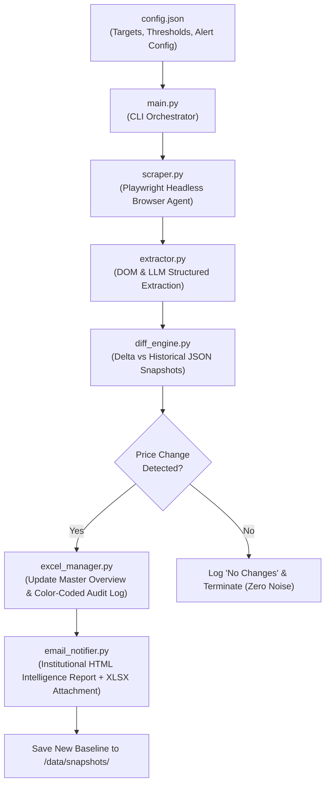

# 🛡️ MarginGuard: Autonomous Competitor Price & Menu Intelligence

> **An automated, institutional-grade competitive intelligence agent** that monitors competitor service menus and pricing using headless browser agents (Playwright) + Multimodal LLMs, maintains a synchronized, color-coded master Excel workbook (`.xlsx`), and generates McKinsey/Bloomberg-style executive intelligence alerts.

---

## 🎯 The ICP & The Problem

* **Target ICP:** 50–300 person service and product businesses (regional medical aesthetics clinics, salon networks, multi-location dental practices, commercial services, and boutique agencies).
* **The Operational Bottleneck:** Competitors do not provide APIs; pricing lives inside JavaScript-rendered SPAs, dynamic booking widgets, and interactive price tables. Manual tracking takes 4–6 hours weekly, causing businesses to discover competitor price drops and new offerings *after* losing deals.
* **The Solution:** A lightweight Python sentinel that renders target endpoints headlessly, extracts validated pricing schemas, computes semantic deltas against historical baselines, synchronizes an Excel master workbook, and sends zero-noise intelligence alerts to leadership.

---

## 🏛️ System Architecture



---

## 📁 Repository Structure

```text
├── config.json              # Competitor targets, notification thresholds, and storage paths
├── models.py               # Strict Pydantic models (MenuItem, CompetitorSnapshot, PriceDelta, DiffReport)
├── scraper.py              # Playwright browser agent (JS rendering, cookie dismissal, viewport capture)
├── extractor.py            # Multimodal LLM parser + DOM table/card heuristic fallback
├── diff_engine.py          # Delta calculation (price hikes, drops, new offerings, discontinued services)
├── excel_manager.py        # openpyxl engine managing competitor_price_tracker.xlsx with color-coded history
├── email_notifier.py       # Bloomberg/McKinsey-style HTML intelligence bulletin generator
├── main.py                 # CLI tool supporting simulation demo and live web scraping modes
├── requirements.txt        # Minimal Python dependencies
├── SUBSTACK_ARTICLE.md     # Complete Substack/newsletter-style submission article
├── test_sites/             # Standalone local test competitor endpoints for offline/live testing
│   ├── lumina_services.html
│   └── serenity_pricing.html
└── data/
    ├── competitor_price_tracker.xlsx   # Generated formatted Excel workbook
    ├── reports/                        # Generated HTML intelligence reports
    └── snapshots/                      # Historical JSON baselines for diffing
```

---

## ⚡ Quick Start & Installation

### 1. Prerequisites
- Python 3.10+ (Tested on Python 3.13)
- Google Chrome / Chromium

### 2. Clone and Install Dependencies
```bash
git clone https://github.com/Varun2045/MarginGuard.git
cd MarginGuard

# Install Python requirements
pip install -r requirements.txt

# Install Playwright browser binaries
playwright install chromium
```

---

## 🚀 Running the Workflow

### Mode 1: Simulated Executive Demo
Simulates a week-over-week competitor pricing update (price hike, price drop, new offering, and discontinued item) to demonstrate delta detection, Excel formatting, and report generation:

```bash
python main.py
```
*(On Windows, you can also run: `py -3.13 main.py`)*

#### Expected Terminal Output:
```text
======================================================================
 [*] AI COMPETITOR PRICE & MENU MONITORING SENTINEL - RUNNING
======================================================================

[1/4] Baseline Snapshot Loaded: Lumina Medical Spa & Wellness (5 active services)
[2/4] Headless Browser Agent navigated and extracted live menu...
[3/4] Running Semantic Diff Engine...
      - Price Hikes: 1
        [+] HIKE: Hydrafacial Deluxe: $199.00 -> $225.00 (+13.1%)
      - Price Drops: 1
        [-] DROP: Full Body Laser Hair Removal: $350.00 -> $299.00 (-14.6%)
      - New Offerings: 1
        [*] NEW : Morpheus8 RF Microneedling: $750.00
      - Discontinued: 1
        [x] REMOVED: Chemical Peel Standard

[4/4] Updating Master Excel Spreadsheet & Dispatching Alerts...
      [OK] Excel Workbook updated: ./data/competitor_price_tracker.xlsx
[SUCCESS] Enterprise intelligence report saved to: ./data/reports/email_preview_...html
[MOCK EMAIL] Dispatching alert to: owner@apexwellness.com
[MOCK EMAIL] Attached Excel: ./data/competitor_price_tracker.xlsx

======================================================================
 [OK] WORKFLOW COMPLETE: Owner notified & Excel tracker synchronized!
======================================================================
```

---

### Mode 2: Live Browser Scraping
Launches Playwright headless Chromium against the configured endpoints in `config.json`:

```bash
python main.py --live
```

---

## 📊 Viewing the Outputs

### 1. Master Excel Tracker (`./data/competitor_price_tracker.xlsx`)
Open in Microsoft Excel to inspect:
- **Sheet 1: `Current Pricing Overview`** — Live master pricing table across all monitored competitors.
- **Sheet 2: `Price Change History`** — Timestamped audit log:
  - 🔴 **Soft Red:** Price Increases
  - 🟢 **Soft Green:** Price Drops (Promotions)
  - 🔵 **Soft Blue:** Newly Launched Services

### 2. Institutional Intelligence Report (`./data/reports/email_preview_*.html`)
Double-click any generated report file to open it in your browser. It features:
- **Header:** Institutional metadata and alert tag (no emojis or dark gradient hero).
- **Summary KPIs:** Minimalist 4-block summary metrics.
- **Data Table:** Tabular right-aligned financial deltas and percentage shifts.
- **What Changed:** Factual, bulleted observations.
- **Why It Matters:** Conservative, evidence-based strategic rationale.
- **Recommended Review:** Suggested human actions for leadership.
- **Data Export Box:** Reference block for the attached Excel workbook.

---

## ⚙️ Configuration (`config.json`)

To monitor custom competitor URLs or adjust alert parameters:

```json
{
  "business_info": {
    "name": "Apex Wellness & Aesthetics",
    "currency": "USD",
    "owner_email": "owner@apexwellness.com",
    "notification_threshold_pct": 5.0
  },
  "competitors": [
    {
      "id": "competitor_alpha",
      "name": "Competitor Alpha",
      "url": "https://competitor-alpha.com/pricing",
      "category": "Aesthetics"
    }
  ],
  "email_config": {
    "enabled": true,
    "smtp_server": "smtp.gmail.com",
    "smtp_port": 587,
    "sender_email": "alerts@business.com",
    "recipient_email": "owner@business.com",
    "mock_mode": true
  }
}
```

*Set `"mock_mode": false` and specify `SMTP_PASSWORD` as an environment variable to dispatch live emails.*

---

## 📝 Assignment Documentation

For the complete Substack tutorial writeup and alternative capability pairings, see [**`SUBSTACK_ARTICLE.md`**](SUBSTACK_ARTICLE.md).
