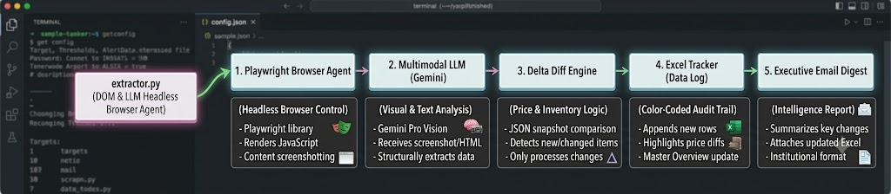

# MarginGuard: Automated Competitor Price & Menu Intelligence for Mid-Market Enterprises

Subtitle: How 50–300 person businesses can automatically track competitor pricing shifts across messy JS booking widgets, keep a synchronized master Excel sheet, and get zero-noise executive alerts before margin leaks happen.

## 1. The Capability Spotted & The Engineering Caveat

### The Capability
Recently released Multimodal Computer-Use & Vision-Driven Headless Browser Agents (Playwright + Gemini 2.0 Flash / Claude 3.7 Sonnet). Traditional scrapers break on JavaScript-heavy SPAs, shadow DOMs, dynamic booking widgets, and anti-bot overlays. Modern browser agents can visually render any web surface, dismiss cookie banners, scroll for lazy-loaded pricing tiers, and extract clean structured JSON without brittle CSS selector maintenance.

### The Honest Engineering Caveat & How We Designed Around It
* **The Caveat:** Web pages change layout dynamically, and LLM text extraction can occasionally produce false positives or hallucinated price deltas if an item is slightly reworded or missed.
* **Our Architectural Defense:**
  1. **Historical Delta Thresholding:** The diff engine enforces a configurable threshold (e.g. `notification_threshold_pct: 5.0%`) to ignore minor rounding artifacts.
  2. **Timestamped Snapshot Archiving:** Raw page HTML and screenshots are archived in `./data/snapshots/` and `./data/screenshots/` alongside the extracted JSON so any alerted change can be human-verified in 1 click.
  3. **Zero-Noise Suppression:** If no significant price shifts or new offerings are detected, the agent logs silently and exits—preventing executive alert fatigue.

## 2. The ICP Pain Point & Why This Pairing Makes Sense

### Target ICP
50–300 person service & product businesses in North America and MENA (regional medical spa networks, aesthetics clinics, multi-location dental practices, auto repair groups, commercial catering/restaurants, and boutique marketing/development agencies).

### The Real Operational Pain
In mid-market service businesses, margins are razor thin and highly sensitive to local competitor pricing. However:
- Competitor websites don't offer public APIs.
- Menus and pricing live inside complex booking widgets, PDF embeds, or interactive price lists.
- Checking 5–10 competitor websites weekly requires 4–6 hours of manual, mind-numbing administrative work.
- As a result, businesses only find out a competitor slashed laser package rates by 20% or hiked Botox prices *after* prospective clients start churning during sales calls.

### Why This Pairing Makes Sense
Browser agents are uniquely suited for **unstructured, API-less web surfaces**. By combining headless browser rendering with a deterministic Python diff engine, native Excel history logging (`openpyxl`), and executive HTML email dispatch (`smtplib`), we turn a 5-hour weekly manual task into a 30-second automated cron job.

## 3. Step-by-Step Workflow Tutorial

<p align="center">
  
</p>

### Step 1: Headless Navigation & Page Snapshotting (`scraper.py`)
The browser agent launches Playwright with a realistic desktop viewport and user agent. It navigates to the competitor pricing URL, automatically detects and dismisses cookie consent dialogs, performs incremental scrolls to trigger lazy loading, and captures a timestamped screenshot.

```python
# scraper.py (excerpt)
async with async_playwright() as p:
    browser = await p.chromium.launch(headless=True)
    page = await browser.new_page(viewport={"width": 1280, "height": 800})
    await page.goto(url, wait_until="networkidle", timeout=25000)
    # Dismiss cookie banners & scroll
    await page.evaluate("window.scrollTo(0, document.body.scrollHeight);")
    content = await page.content()
    await page.screenshot(path=f"./data/screenshots/{clean_name}.png")
```

### Step 2: Structured Extraction with Pydantic Schemas (`extractor.py` & `models.py`)
Rather than relying on fragile CSS selectors, the cleaned DOM text or visual snapshot is passed to the LLM with a strict JSON schema:

```python
# models.py
class MenuItem(BaseModel):
    name: str
    category: str = "General"
    price: float
    currency: str = "USD"
    unit: Optional[str] = "session"
```

The extractor parses the service offerings, normalizes pricing into numerical floats, standardizes billing units (per session, per unit, monthly), and returns a validated `CompetitorSnapshot`.

### Step 3: The Semantic Diff Engine (`diff_engine.py`)
The diff engine loads the previous snapshot from `./data/snapshots/{competitor_id}_latest.json` and performs key-matching to detect:
* **Price Hikes:** `new_price > old_price` (computes exact $ delta and % increase)
* **Price Drops:** `new_price < old_price` (highlights potential competitor promotions/undercutting)
* **New Service Offerings:** Newly listed treatments or packages
* **Discontinued Services:** Offerings removed from the menu

### Step 4: Master Excel Spreadsheet Synchronization (`excel_manager.py`)
The script uses `openpyxl` to maintain an executive workbook (`./data/competitor_price_tracker.xlsx`) with two dedicated sheets:
1. **`Current Pricing Overview`**: Live master table of all active competitor services, current rates, and last verified timestamps.
2. **`Price Change History`**: A color-coded audit trail:
   - 🔴 **Soft Red:** Price Hikes
   - 🟢 **Soft Green:** Price Drops (Promotions)
   - 🔵 **Soft Blue:** Newly Launched Services

```python
# excel_manager.py (Color formatting excerpt)
if delta.change_type == "PRICE_INCREASE":
    fill_to_apply = PatternFill(start_color="FEE2E2", fill_type="solid") # Red
elif delta.change_type == "PRICE_DECREASE":
    fill_to_apply = PatternFill(start_color="DCFCE7", fill_type="solid") # Green
```

### Step 5: Executive Email Digest with Attachment (`email_notifier.py`)
If and only if significant price shifts are detected, the agent formats an institutional, Bloomberg/McKinsey-style HTML intelligence report and dispatches it via SMTP to the executive team with the updated Excel file attached.

## 4. Visual Proof & Screenshots Guide

### 📸 Screenshot 1: Terminal Execution & Diff Output
*Shows the CLI running the headless browser, detecting a +13.1% hike on Hydrafacial, a -14.6% drop on Laser Hair Removal, a new Morpheus8 service, and calculating tabular deltas.*
(Take a screenshot of the terminal running `py -3.13 main.py`)

### 📸 Screenshot 2: Master Excel Tracker (`competitor_price_tracker.xlsx`)
*Shows the two sheets: Current Pricing Overview and the color-coded Price Change History.*
(Take a screenshot of Excel opened with `Price Change History` highlighting green/red rows)

### 📸 Screenshot 3: Institutional Intelligence Report Preview
*Shows the clean, restrained enterprise intelligence alert with KPI data blocks, tabular financial change table, factual "What Changed" bullet points, "Why It Matters" strategic interpretation, and human review action items.*
(Open `./data/reports/email_preview_....html` in your browser and screenshot)

### 🎥 Animated Demo GIF Guide
*Use a screen recorder (e.g. ScreenToGif or CleanShot) showing:*
1. Terminal command execution (`py -3.13 main.py`)
2. Terminal showing detected changes in under 3 seconds
3. Switching to the generated enterprise HTML intelligence report in browser
4. Switching to the updated Excel spreadsheet with the highlighted audit rows

## 5. Alternative Capability-to-Pain-Point Pairings for this ICP

Here are 3 other high-value pairings designed specifically for 50–300 person businesses in North America and MENA:

| # | Recent AI Capability | ICP Operational Bottleneck | Minimal Workflow Build |
|---|---|---|---|
| **1** | **MENA Bilingual Reasoning (Arabic/English LLMs)** | **WhatsApp & Support Ticket Sentiment Sentinel:** Multilingual client accounts in UAE/Saudi switch between English and Arabic dialects. Account managers miss subtle escalation cues until clients churn. | A lightweight Python webhook that ingests daily support/chat logs, identifies subtle dissatisfaction in Franco-Arabic or English, and alerts account directors in Slack. |
| **2** | **Audio Diarization + Structured Document Synthesis** | **Sales Call to Client SOW / Proposal Generator:** After discovery calls, account executives take 3–5 days to manually write custom proposals, losing deal momentum. | A Python script that takes call audio/transcripts + rate cards and auto-generates a formatted Google Doc proposal within 60 seconds. |
| **3** | **Firecrawl Web Scraper + Pydantic Function Calling** | **Speed-to-Lead Instant Inbound Triage:** Form submissions wait 4–8 hours for SDR research. Leads go cold if not replied to in 15 minutes. | A script that triggers on new Google Sheet rows, scrapes the prospect's company website, scores fit, and creates a pre-drafted personalized email in Gmail Drafts. |

## 6. How to Run Locally

```bash
# 1. Clone/navigate to directory
git clone https://github.com/Varun2045/MarginGuard.git
cd MarginGuard

# 2. Run simulation demo (generates Excel & HTML email preview)
py -3.13 main.py

# 3. Run live scraping against targets in config.json
py -3.13 main.py --live
```
